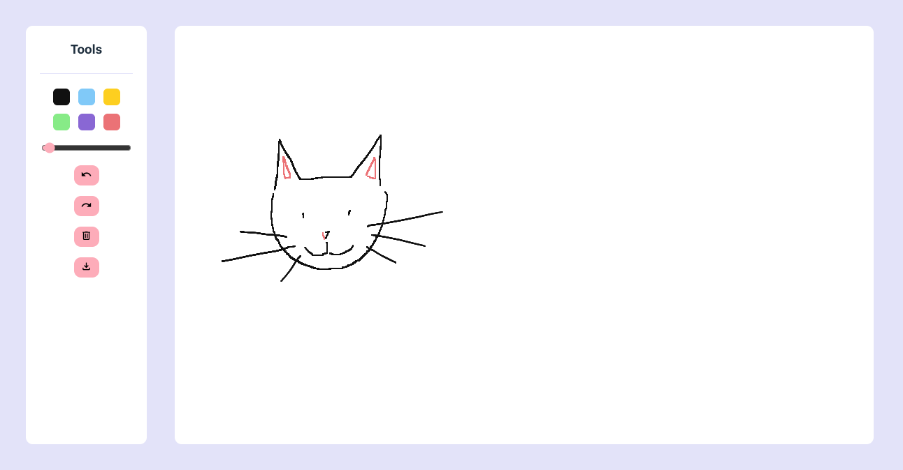

# canvas

A drawing tool 🖋️



## changelog

TBA

## todo

- Time limit clicking off canvas
- Fix redo bug
- Save functionality

## developing

Once you've created a project and installed dependencies with `npm install` (or `pnpm install` or `yarn`), start a development server:

```bash
npm run dev

# or start the server and open the app in a new browser tab
npm run dev -- --open
```

## building

To create a production version of your app:

```bash
npm run build
```
